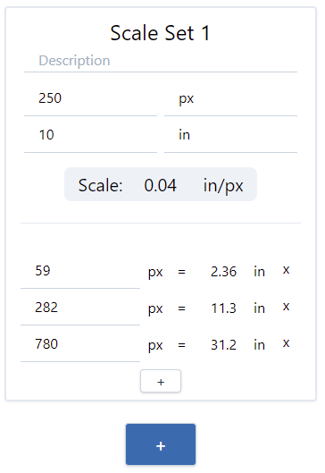

# Scale Tool

Helper application for scaling measurements such as from digital images.

Establish the scale by entering the measured value and unit (optional) followed
by the actual value and unit (optional).

Then, add additional measurements in the "measured" unit to calculate the
actual value.

